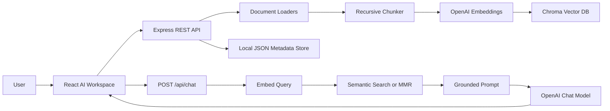
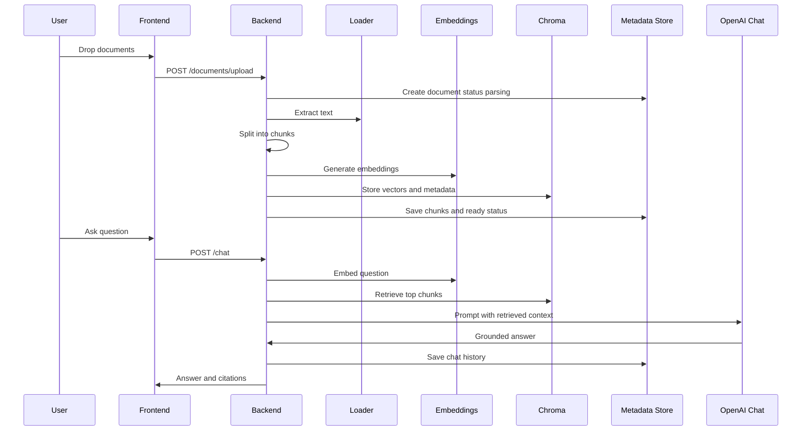

# Technical Documentation

## Project Overview

This project is a practical RAG-based document Q&A app. Users upload documents, the backend extracts and chunks text, embeddings are stored in Chroma, and chat queries retrieve relevant chunks before calling the LLM.

## Problem Statement

Large language models do not automatically know private uploaded documents. RAG solves this by retrieving relevant document context at question time and forcing the model to answer from that context.

## Tech Stack

| Layer | Technology | Why |
| --- | --- | --- |
| Frontend | React, TypeScript, Vite | Fast, typed, portfolio-friendly UI |
| Styling | Tailwind CSS, Lucide icons | Modern workspace UI with consistent controls |
| Backend | Node.js, TypeScript, Express | Common SDE stack with clear REST APIs |
| RAG | LangChain.js | Embeddings, chat model, and text splitting |
| Vector DB | Chroma | Simple local vector database for demos |
| Optional Vector DB | Pinecone | Cloud vector database path for scaling |
| Metadata | Local JSON store | Easy to inspect and avoids native DB setup |
| LLM | OpenAI | Reliable default provider |

## Architecture

## Upload to Answer Data Flow

## RAG Pipeline

1. Validate upload by file type, size, duplicates, and empty files.
2. Extract text with Node libraries:
   - `pdf-parse` for PDFs
   - `mammoth` for DOCX
   - Buffer decoding for TXT/Markdown
3. Split text using `RecursiveCharacterTextSplitter`.
4. Attach metadata:
   - source filename
   - document id
   - collection id
   - chunk index
   - page number when available
   - section heading when detectable
5. Generate embeddings with OpenAI.
6. Store vectors in Chroma.
7. On chat, embed the user query.
8. Retrieve top chunks using similarity or MMR.
9. Build a grounded prompt.
10. Generate an answer with citations.

## Chunking Strategy

Default settings:

- `CHUNK_SIZE=1000`
- `CHUNK_OVERLAP=180`

Why:

- 1000 characters usually keeps enough local meaning for Q&A.
- overlap reduces the chance that key facts are split across chunk boundaries.
- recursive separators prefer paragraph and sentence boundaries before falling back to words.

## Embedding Strategy

Default model: `text-embedding-3-small`.

The app embeds:

- every document chunk during indexing
- each user question during retrieval

Embeddings turn text into vectors, allowing semantic search instead of keyword-only search.

## Vector Search

Chroma stores:

- vector id
- embedding
- raw chunk text
- metadata

The app filters by `collectionId`, so each collection behaves like a separate knowledge base.

Retrieval modes:

- `similarity`: returns nearest vectors
- `mmr`: retrieves more candidates and selects diverse relevant chunks

## Prompting Strategy

The prompt tells the model:

- answer only from context
- say "I do not know" when unsupported
- cite every factual claim with source tags
- do not invent filenames, page numbers, or facts

This reduces hallucination and makes answers auditable.

## Backend Architecture

Important folders:

- `routes`: URL definitions
- `controllers`: request and response logic
- `services`: application workflows
- `loaders`: document parsing
- `rag`: chunking, embeddings, LLM, vector store
- `storage`: local metadata persistence
- `middleware`: validation, upload, and error handling

## Frontend Architecture

Important folders:

- `components`: sidebar, upload, documents, chat, citations, settings
- `hooks`: collections, documents, chat, theme state
- `lib/api.ts`: typed API client
- `pages/Workspace.tsx`: main application layout

The UI is intentionally an AI workspace, not a landing page.

## Metadata and Vector DB

Local JSON stores:

- collections
- documents
- chunks
- chat messages

Chroma stores:

- chunk vectors
- chunk text
- vector metadata

The split makes the project easy to inspect while still demonstrating vector database usage.

## Error Handling

Handled cases:

- missing OpenAI API key
- empty file
- unsupported file type
- corrupted document
- duplicate filename
- no documents uploaded
- Chroma unavailable
- LLM provider failure
- frontend network failure

## Known Limitations

- Local JSON is not a multi-user database.
- Scanned PDFs need OCR before upload.
- The app does not include authentication.
- Reranking is MMR-based, not a cross-encoder reranker.

## Future Improvements

- Add user auth and per-user collections
- Add OCR for scanned PDFs
- Add background indexing jobs
- Add hybrid search with BM25 plus vectors
- Add evaluation datasets and retrieval metrics
- Add Claude provider implementation behind the LLM interface
- Move metadata to SQLite or PostgreSQL for production
